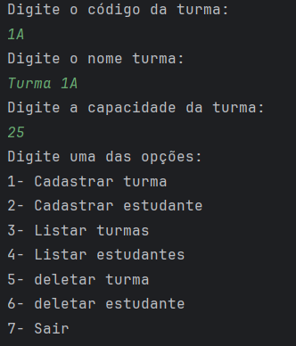
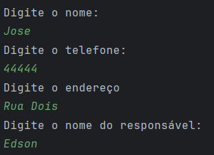
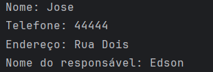
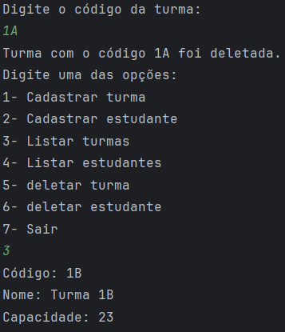
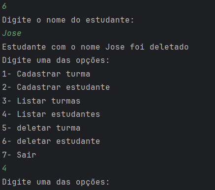

# Sobre o projeto

Projeto feito para a realização de cadastro de turmas e alunos, com o objetivo de praticar conceitos de CRUD (Create,Read,Update,Delete) e também aprimorara os conceitos de encapsulamento.

# Mostrando o programa

Apresentação do menu e cadastro de turma.

Fazendo cadastro do estudante.

Listando turmas e estudantes.

  

Deletando turma e estudante

   
